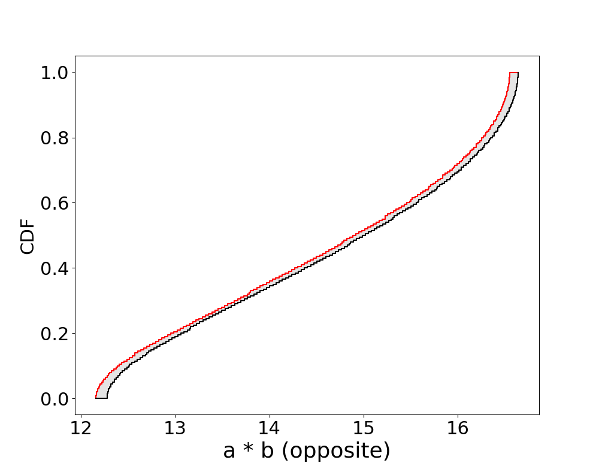

# Arithmetic 


```@meta
# foo

#=

Supported dependent arithmetic between uncertain numbers:

|                           |     independent    | dependency known   | dependency unknown | perfect/opposite     | partial information  |
|:-------------------------:|:------------------:|:------------------:|:------------------:|:--------------------:|:--------------------:|
| intervals                 | not known to exist |         solutions exist        |         yes        |  solutions exist |  solutions exist |
| probability distributions |         yes        |         yes        |         yes        |          yes         |          yes        |
| probability boxes         |         yes        |         yes        |         yes        |          yes         |          yes        |


||independent|dependency known|dependency unknown|perfect/opposite|partial information|
|---------------------------|:------------------:|--------------------|--------------------|----------------------|----------------------|
|intervals|not known to exist|solutions exist|yes|solutions exist|solutions exist|
|probability distributions|yes|yes|yes|yes|yes|
|probability boxes|yes|yes|yes|yes|yes|

=#

```

Most of the fundamental binary operations can be performed between uncertain numbers of all types:

```julia
julia> a = normal(10,1); 
julia> b = uniform(1,2);
julia> a + b
 Pbox: 	  ~  ( range=[7.9098, 15.09], mean=11.5, var=[0.38392, 2.1086])

julia> a - b
 Pbox: 	  ~  ( range=[4.9098, 12.09], mean=8.5, var=[0.38392, 2.1086])

julia> a * b
 Pbox: 	  ~  ( range=[6.9098, 26.18], mean=[12.194, 18.069], var=[0.6576, 32.544])

julia> a / b
 Pbox: 	  ~  ( range=[3.4549, 13.09], mean=[5.6205, 8.3861], var=[0.13574, 7.6644])
```
```@raw html


```
By default all arithmetic operations in `ProbabilityBoundsAnalysis.jl` are _Frechet_ operations, operations which consider all possible dependencies (copulas). Therefore we naturally get p-boxes even if we began with precise distributions. For independence:
```julia
julia> convIndep(a, b, op = +)
 Pbox: 	  ~  ( range=[7.9098, 15.09], mean=11.5, var=1.0833)

julia> convIndep(a, b, op = -)
 Pbox: 	  ~  ( range=[4.9098, 12.09], mean=8.5, var=1.0833)

julia> convIndep(a, b, op = *)
 Pbox: 	  ~  ( range=[6.9098, 26.18], mean=15.0, var=[10.052, 11.538])

julia> convIndep(a, b, op = /)
 Pbox: 	  ~  ( range=[3.4549, 13.09], mean=[6.919, 6.944], var=[2.3032, 2.6815])
```

The resulting p-boxes are precise.

```@raw html


```

Perfect and opposite convolutions can also be performed:
```julia
julia> convPerfect(a, b, op = +)
 Pbox: 	  ~  ( range=[7.9098, 15.09], mean=[11.482, 11.518], var=[1.5807, 1.7096])

julia> convPerfect(a, b, op = *)
 Pbox: 	  ~  ( range=[6.9098, 26.18], mean=[15.234, 15.33], var=[18.661, 19.605])

julia> convOpposite(a, b, op = +)
 Pbox: 	  ~  ( range=[8.9048, 14.095], mean=[11.482, 11.518], var=[0.47843, 0.55648])

julia> convOpposite(a, b, op = *)
 Pbox: 	  ~  ( range=[12.162, 16.638], mean=[14.67, 14.766], var=[2.0885, 2.3469])
```

```@raw html



```

Binary operations with a specified correlation coefficient may also be performed:

```julia
julia> conv(a, b, op = *, corr = -0.5)
 Pbox: 	  ~  ( range=[6.9098, 26.18], mean=15.0, var=[5.5032, 7.9116])

julia> conv(a, b, op = *, corr = 0.5)
 Pbox: 	  ~  ( range=[6.9098, 26.18], mean=15.0, var=[12.985, 16.804])
```
```@raw html


```

This assumes that a and b follow a Gaussian Copula. You may however perform the operation with any copula by using the function
```julia
julia> C1 = clayton(5)
julia> convCorr(a, b, op = *, C = C1)
 Pbox: 	  ~  ( range=[6.9098, 26.18], mean=[15.024, 15.473], var=[15.738, 19.714])

julia> C2 = Frank(-2)
julia> convCorr(a, b, op = *, C = C2)
 Pbox: 	  ~  ( range=[6.9098, 26.18], mean=15.0, var=[6.78, 9.5713])
```
where C is a copula (see section on dependence modelling).

```@raw html


```

Note that:

```julia
conv(a, b, op = op, corr = 0)               == convIndep(a, b, op = op)
conv(a, b, op = op, corr = 1)               == convPerfect(a, b, op = op)
conv(a, b, op = op, corr = -1)              == convOpposite(a, b, op = op)
conv(a, b, op = op, corr = interval(-1,1))  == convFrechet(a, b, op = op)
```
