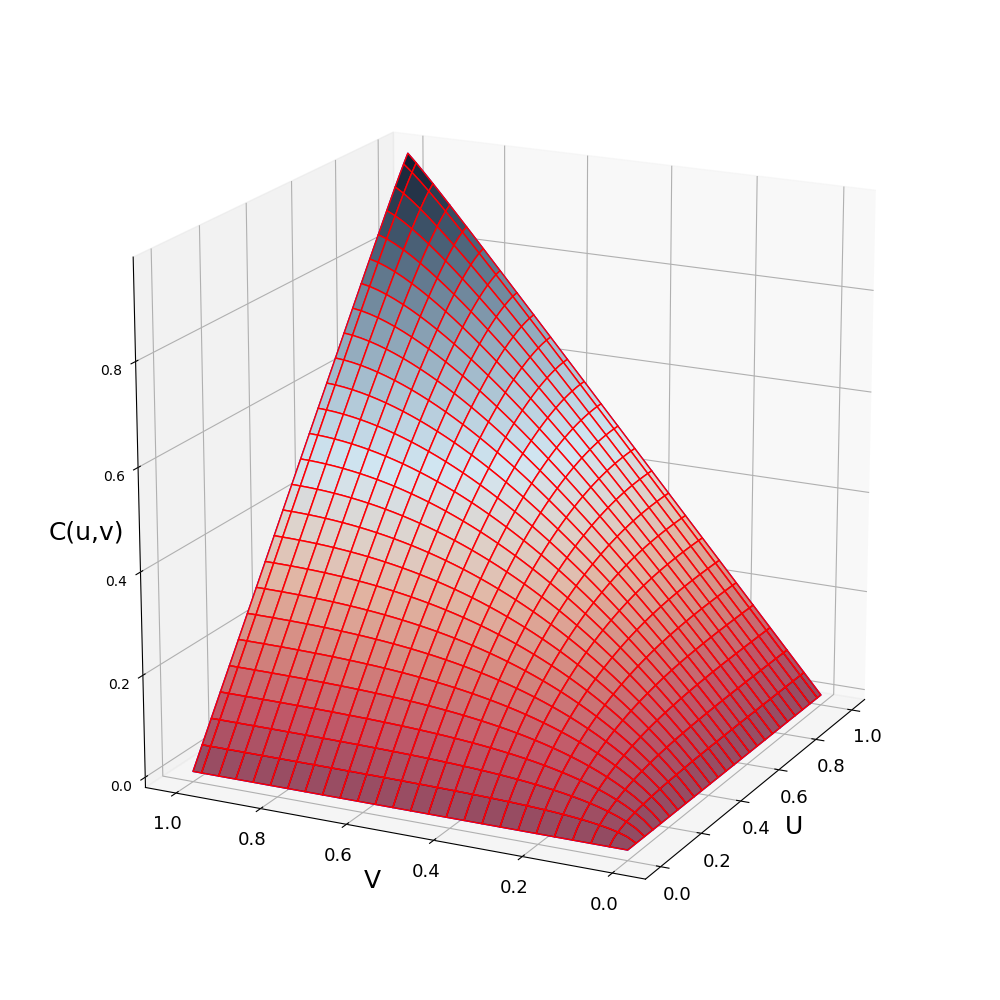
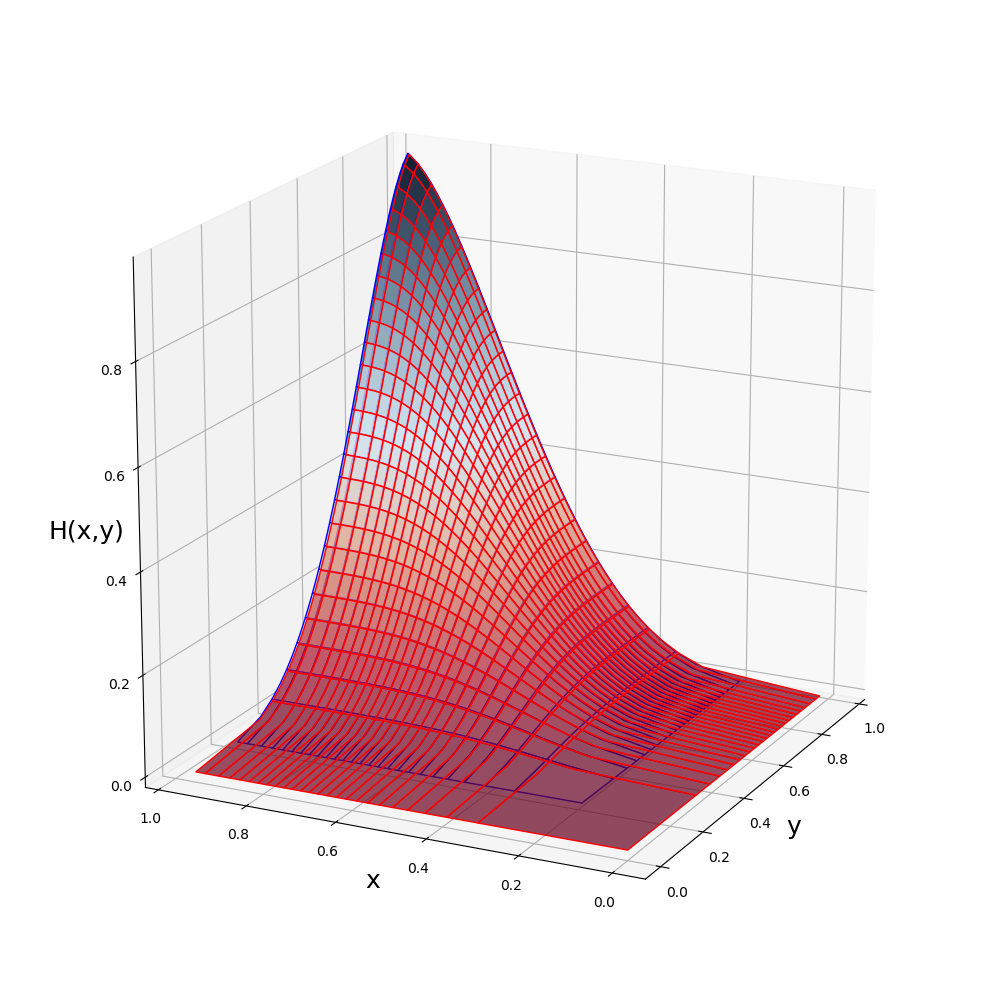
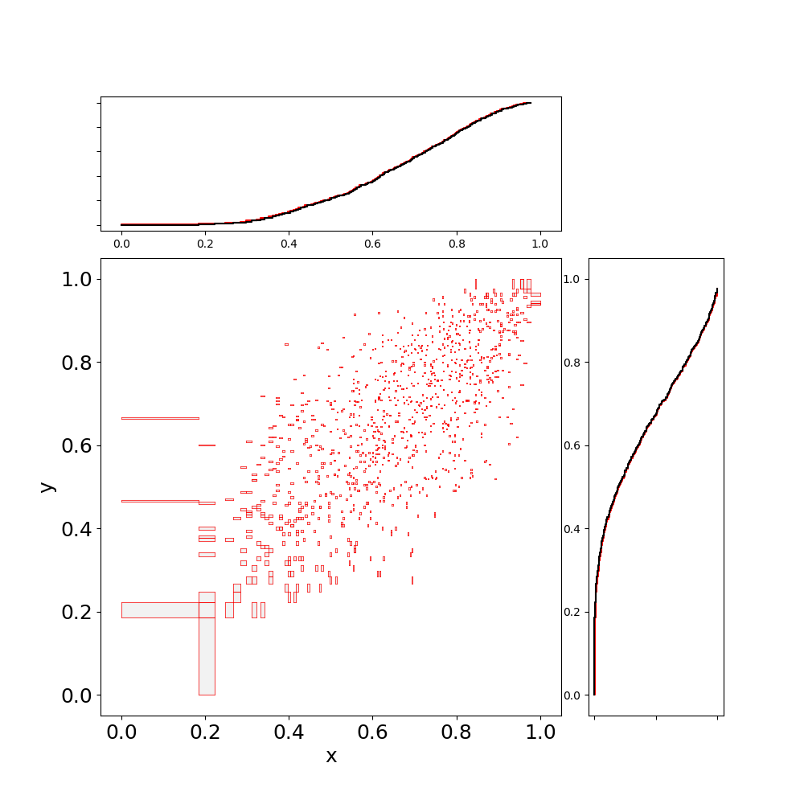
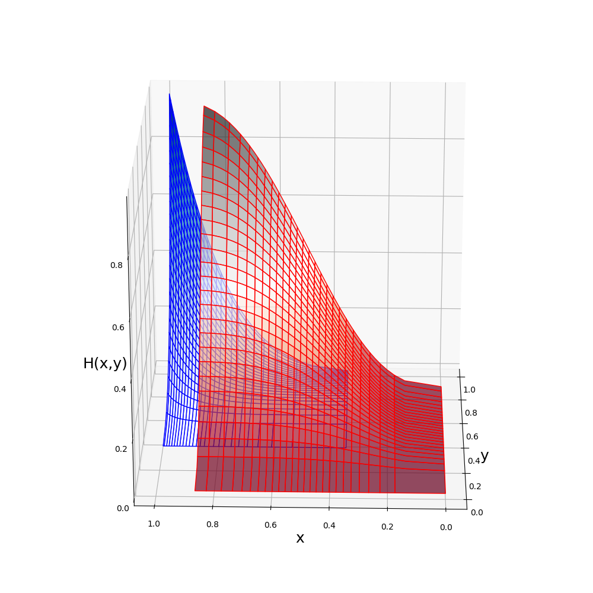
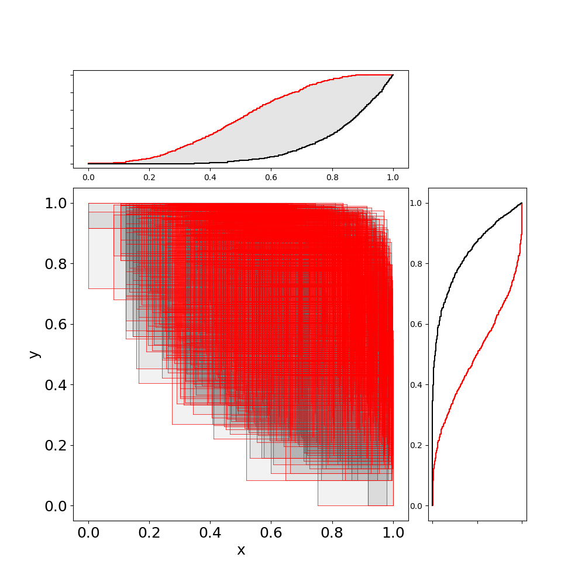

# Modelling dependencies with copulas

Any possible multivariate dependence can be encoded in a [copula](https://en.wikipedia.org/wiki/Copula_(probability_theory)). Copulas, sometimes called dependency functions, are a joint cdf with standard uniform marginals, and are a way to model dependency independently of marginal distributions. 

The supported copulas are:

  * π: independence
  * M: perfect dependence and the upper Frechét bound
  * W: opposite dependence and the lower Frechét bound
  * Gaussian: family with correlation coefficient r (-1 for W, 0 for π, 1 for M)
  * Frank: family with parameter s (0 for W, 1 for π, Inf for M)
  * Clayton: family with parameter t (-1 for W, 0 for π, Inf for M)

A copula can be created and plotted in the following way:

```julia
julia> C = GauCopula(0.7)
 Copula ~ Gau(r=0.7)

julia> using PyPlot
julia> plot(C)
```


A copula ``C`` is the function ``C:[0,1]^d \rightarrow [0,1]``, where d is the dimension of the copula. Only bivariate copulas are considered so far in `ProbabilityBoundsAnalysis.jl`. A copula can be evaluated and sampled in the following way:


```julia
julia> C(0.5,0.5)
 [0.370898, 0.375924]

julia> C([0.2,0.6],[0.3,0.7])
2×2 Array{Interval{Float64},2}:
 [0.140274, 0.144236]  [0.191086, 0.196042]
 [0.270231, 0.275108]  [0.524632, 0.53028]
 
julia> samps = sample(C,10^4);
```

Note that like distributions and p-boxes, in `ProbabilityBoundsAnalysis.jl` samples and evaluations of copulas are intervals. This also allows copulas to be imprecisely defined (set of dependencies). An imprecise copula can be created by giving the constructor and interval:


```julia
julia> C = GauCopula(interval(-0.5,0.5))
 Imp Copula ~ Gaussian(r = [-0.5, 0.5])

julia> C(0.5,0.5)
 [0.164165, 0.33585]

julia> C([0.2,0.6],[0.3,0.7])
2×2 Array{Interval{Float64},2}:
 [0.0162205, 0.116083]  [0.082187, 0.18411]
 [0.105729, 0.248291]   [0.350841, 0.495683]

julia> plot(a)
```
!["Imprecise Gaussian copula with a correlation in [-0.5, 0.5]"](./plots/ImpCopula.png)


Given any marginal distributions ``F_{X}(x)`` and ``F_{Y}(y)`` and a copla ``C( : )``, a joint distribution can be created: ``H(x,y) = C(F_{X}(x), F_{Y}(y))``.  In `ProbabilityBoundsAnalysis.jl` a joint distribution can be created by passing marginals to the copula. For example, a distribution with beta marginals and a gaussian copula:


```julia
julia> C = GauCopula(0.7);
julia> J = C(beta(4,2),beta(4,2))
BivPbox ~ Gaussian( beta(mean = 0.66666, var = 0.031746), beta(mean = 0.66666, var = 0.031746); r = 0.7)

julia> plot(J)
```


A joint distribution can also be sampled:

```julia
julia> Jsamps = sample(J,10^4)
julia> scatter(Jsamps)
```


Notice that samples are bivariate intervals, capturing the representation error of the marginals and the copula. This can be reduced by increasing the descritisation.

A bivariate p-box (bounds on bivariate cdfs) can be created from two marginal p-boxes and an imprecise copula:

```julia
julia> a = b = beta(interval(3,5),interval(1,3))
Pbox: 	  ~ beta ( range=[0.0, 1.0], mean=[0.5, 0.83333], var=[0.019841, 0.0375])

julia> C = GauCopula(interval(-0.5,0.5))
Imp Copula ~ Gaussian(r = [-0.5, 0.5])

julia> J = C(a, b)
BivPbox ~ Gaussian( beta(mean = [0.5, 0.833334], var = [0.0198412, 0.0375]), beta(mean = [0.5, 0.833334], var = [0.0198412, 0.0375]); r = [-0.5, 0.5])

julia> plot(J)
```


If the copula is precise, but the marginals are p-boxes, then the bivariate p-box may also be sampled. This generates a correlated random set.

```julia
julia> a = b = beta(interval(3,5),interval(1,3));
julia> C = GauCopula(-0.7);
julia> J = C(a, b);
julia> samps = sample(J,10^3)
1000×2 Array{Interval{Float64},2}:
    [0.77936, 0.985591]   [0.146632, 0.495935]
    [0.570252, 0.913177]  [0.559218, 0.907351]
    [0.135267, 0.478177]  [0.785104, 0.986649]
    [0.505333, 0.875713]  [0.592774, 0.924402]
    [0.666583, 0.955155]  [0.260591, 0.65439]
    [0.58992, 0.923029]   [0.718078, 0.971412]

     ⋮                    
    [0.748597, 0.979149]  [0.285952, 0.684256]
    [0.105639, 0.431736]  [0.83419, 0.993927]
    [0.58992, 0.923029]   [0.273638, 0.669988]
    [0.293819, 0.693145]  [0.48933, 0.865264]
    [0.763288, 0.982391]  [0.260591, 0.65439]
    [0.365677, 0.766742]  [0.646901, 0.947835]

julia> scatter(samps)
```
