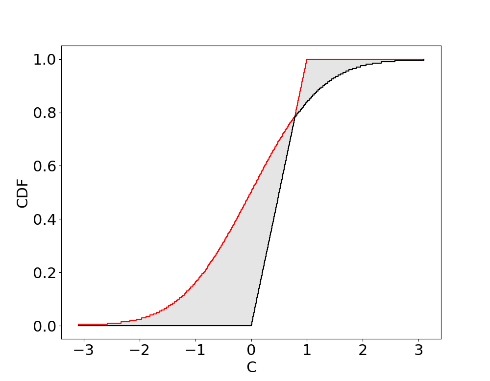
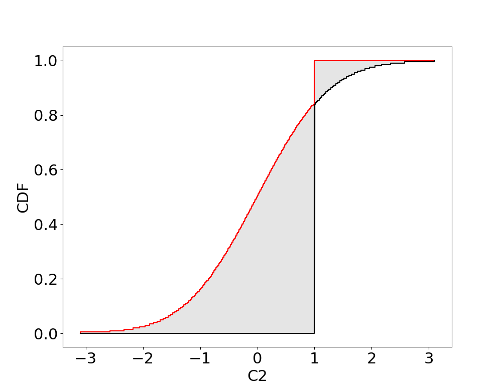
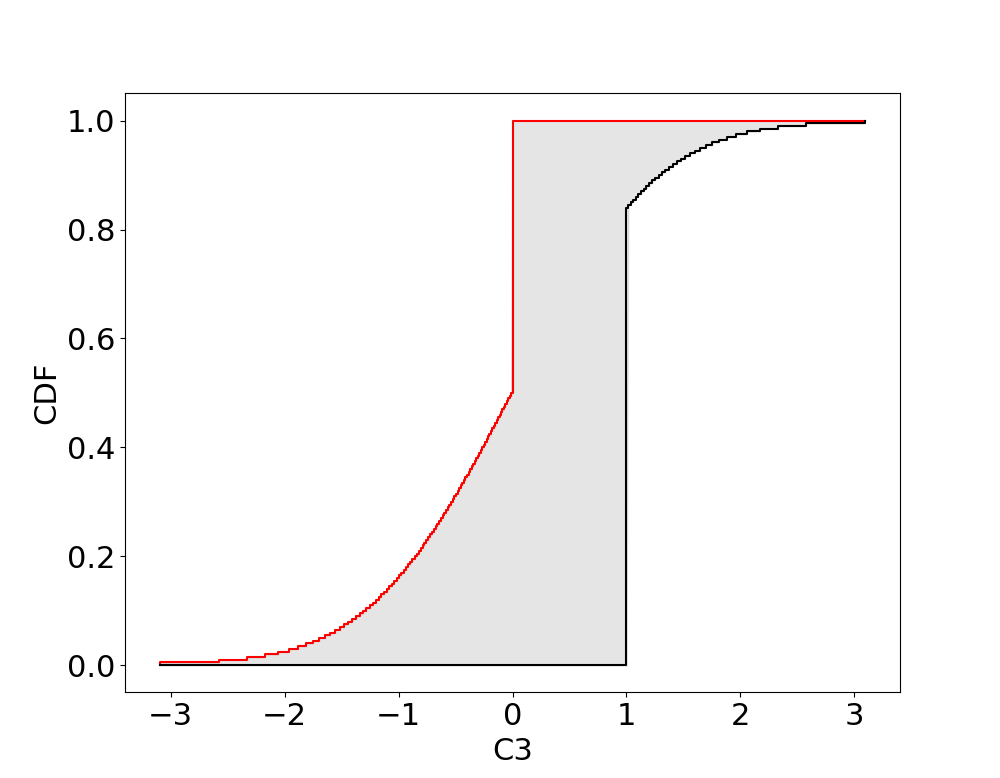
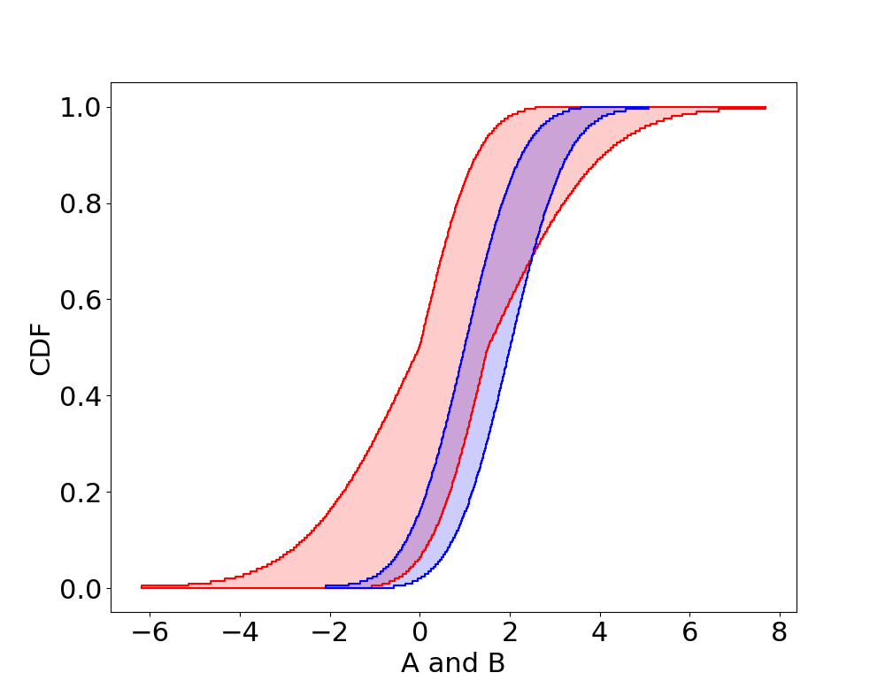

# Comparisons and Set based operations

Comparisons
---

Comparisons `(<, >, <=, >=, ==)` between p-boxes, intervals and scalars can be performed. However unlike for comparisons between real numbers which yield Boolean values (`true` or `false`), comparisons with p-boxes generally yield interval probabilities, giving the uncertainty that the random variable characterised by a p-box meets the condition.

__*NOTE: unlike `IntervalArithmetic.jl`, comparisons in `ProbabilityBoundsAnalysis.jl` will generally give non-Boolean values (interval probabilities). This may cause crashes when evaluating control-flow (if-else) with uncertainty.*__

### Comparisons of p-boxes and scalars

For a p-box `X` and real number `y`, `X <= y` is the evaluation of y in the CDF of X:

)


Similarly, `X >= y` is

)

Example
```julia
julia> X = uniform(0, 1)
julia> X <= 0.7
[0.695, 0.705001]

julia> X >= 0.4
[0.594999, 0.605]

julia> X = normal(interval(-0.5, 0.5), interval(1, 1.5))
julia> X >= 1
[0.0649999, 0.37]
```

Boolean values are returned if the condition is guaranteed

```julia
julia> X = uniform(0, 1)
julia> X <= 2
true

julia> X >= 2
false
```

### Comparisons of p-boxes and intervals

A comparison between a p-box `X` and an interval `Y` can be evaluated as follows


where subtraction is evaluated with p-box arithmetic, and then the resulting p-box's CDF is evaluated at `0`. I.e., `Z = X - Y` and then `cdf(Z, 0.0)`. Similarly


Example
```julia
julia> X = uniform(0, 1)
julia> Y = interval(0.7, 2)
julia> X <= Y
[0.695, 1]

julia> X >= Y
[0, 0.305]

julia> X <= interval(2, 3)
true

julia> X >= interval(2, 3)
false
```

### Comparisons between p-boxes

Comparison between two p-boxes `X` and `Y` are performed similarly to intervals


However, for arithmetic operation (subtraction) to be performed exactly, the dependence (copula) between `X` and `Y` must be known. The default is _Frechet_ (unknown dependence). Therefore, even if we begin with precise p-boxes (distributions), comparisons will give interval probabilities. 

Example

```julia
julia> X = uniform(0, 1)
julia> Y = uniform(0.5, 1.5)
julia> X <= Y
[0.5, 1]

julia> X <= uniform(2, 3)
true

julia> X >= uniform(2, 3)
false
```

The correlation (e.g. independence) can be specified when performing the comparison (which uses a gaussian copula as default)


```julia
julia> X = uniform(0, 1)
julia> Y = uniform(0.5, 1.5)
julia> <=(X,Y, corr = 0)
[0.869999, 0.880001]

julia> >=(X,Y, corr = 0)
[0.119999, 0.130001]

julia> <=(X,Y, corr = 1)
true

julia> <=(X,Y, corr = -1)
[0.744999, 0.755001]

julia> >=(X,Y, corr = 0.5)
[0.04, 0.0550001]
```

Notice that the dependence can greatly change the probability. For example `<=(X,Y, corr = 1)` gave `true` (probability `1`).

Set based operations
---
Since p-boxes are a representation of sets of probabilities, set based operations `(∩, ∪, ⊂, ⊆)` are defined for p-boxes.


### Envelopes (hull or union) of p-boxes, intervals, and scalars

Envelopes between p-boxes, intervals and scalars generally yield p-boxes. The following takes the envelope of a uniform and a gaussian

```julia
julia> using ProbabilityBoundsAnalysis, PyPlot
julia> a = uniform(0, 1)
julia> b = normal(0, 1)
julia> c = a ∪ b            # or env(a, b)
julia> plot(c, fontsize = 22)
```


The following takes the envelope of an scalar and a gaussian

```julia
julia> using ProbabilityBoundsAnalysis, PyPlot
julia> a2 = 1.0
julia> b2 = normal(0, 1)
julia> c2 = a2 ∪ b2            # or env(a2, b2)
julia> plot(c2, fontsize = 22)
```



The following takes the envelope of an interval and a gaussian

```julia
julia> using ProbabilityBoundsAnalysis, PyPlot
julia> a3 = interval(0, 1)
julia> b3 = normal(0, 1)
julia> c3 = a3 ∪ b3            # or env(a3, b3)
julia> plot(c3, fontsize = 22)
```


### Intersection of p-boxes, intervals, and scalars
If non-empty, set intersection can be performed between p-boxes. The following take the intersection between two normal shaped p-boxes `N([0, 1.5], [1, 2]) ∩ N([1, 2], 1) -> N([1, 1.5],1)`

```julia
julia> using ProbabilityBoundsAnalysis, PyPlot, IntervalArithmetic
julia> a = normal(0..1.5, 1..2)
julia> b = normal(1..2, 1)
julia> c = a ∩ b            # or imp(a, b)
julia> plot(a, name = "ab", col = "red", fontsize = 22)
julia> plot(b, name = "ab", col = "blue", fontsize = 22)
julia> plot(c, fontsize = 22)
```
```@raw html


```