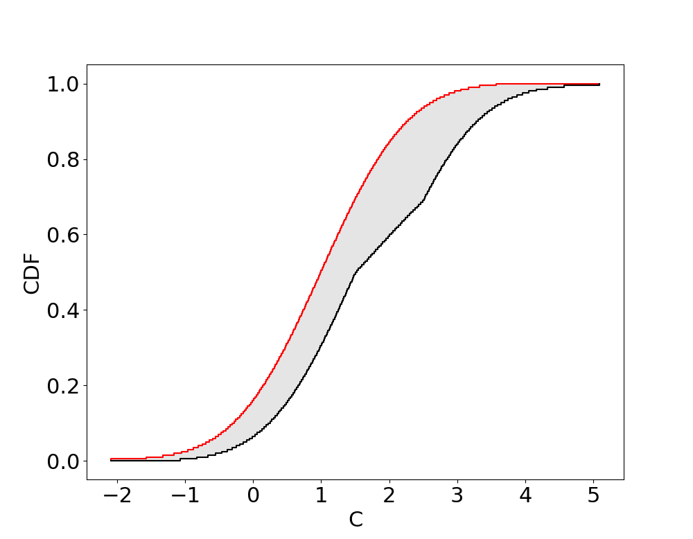

# Comparisons and Set based operations

Comparisons between p-boxes, intervals, and scalars
---


Set based operations
---
Since p-boxes are a representation of sets of probabilities, set based operations `(∩, ∪, ⊂, ⊆)` are defined for p-boxes.


### Envelopes (hull or union) of p-boxes, intervals, and scalars

Envelopes between p-boxes, intervals and scalars generally yield p-boxes. The following takes the envelope of a uniform and a gaussian

```julia
julia> using ProbabilityBoundsAnalysis, PyPlot
julia> a = uniform(0, 1)
julia> b = normal(0, 1)
julia> c = a ∪ b            # or env(a, b)
julia> plot(c, fontsize = 22)
```


The following takes the envelope of an scalar and a gaussian

```julia
julia> using ProbabilityBoundsAnalysis, PyPlot
julia> a2 = 1.0
julia> b2 = normal(0, 1)
julia> c2 = a2 ∪ b2            # or env(a2, b2)
julia> plot(c2, fontsize = 22)
```


The following takes the envelope of an interval and a gaussian

```julia
julia> using ProbabilityBoundsAnalysis, PyPlot
julia> a3 = interval(0, 1)
julia> b3 = normal(0, 1)
julia> c3 = a3 ∪ b3            # or env(a3, b3)
julia> plot(c3, fontsize = 22)
```


### Intersection of p-boxes, intervals, and scalars
If non-empty, set intersection can be performed between p-boxes. The following take the intersection between two normal shaped p-boxes `N([0, 1.5], [1, 2]) ∩ N([1, 2], 1) -> N([1,1.5],1)`

```julia
julia> using ProbabilityBoundsAnalysis, PyPlot, IntervalArithmetic
julia> a = normal(0..1.5, 1..2)
julia> b = normal(1..2, 1)
julia> c = a ∩ b            # or imp(a3, b3)
julia> plot(a, name = "ab", col = "red", fontsize = 22)
julia> plot(b, name = "ab", col = "blue", fontsize = 22)
julia> plot(c, fontsize = 22)
```
 
